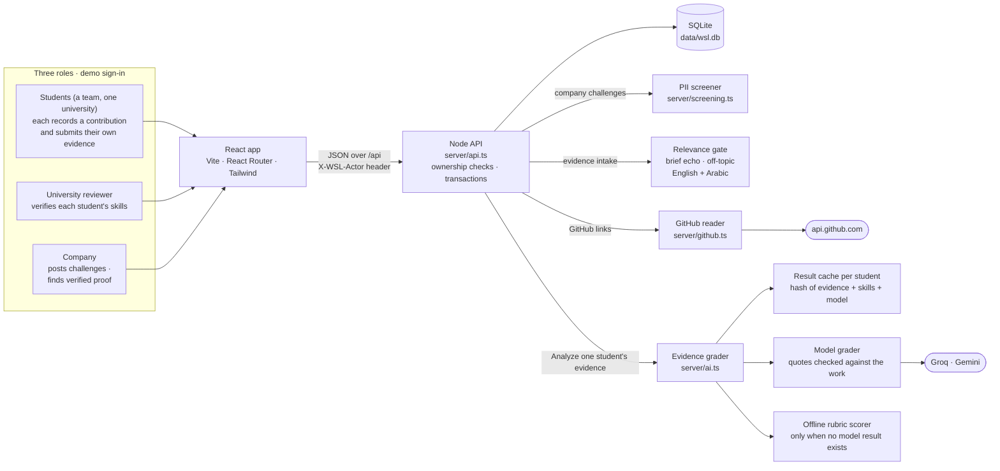
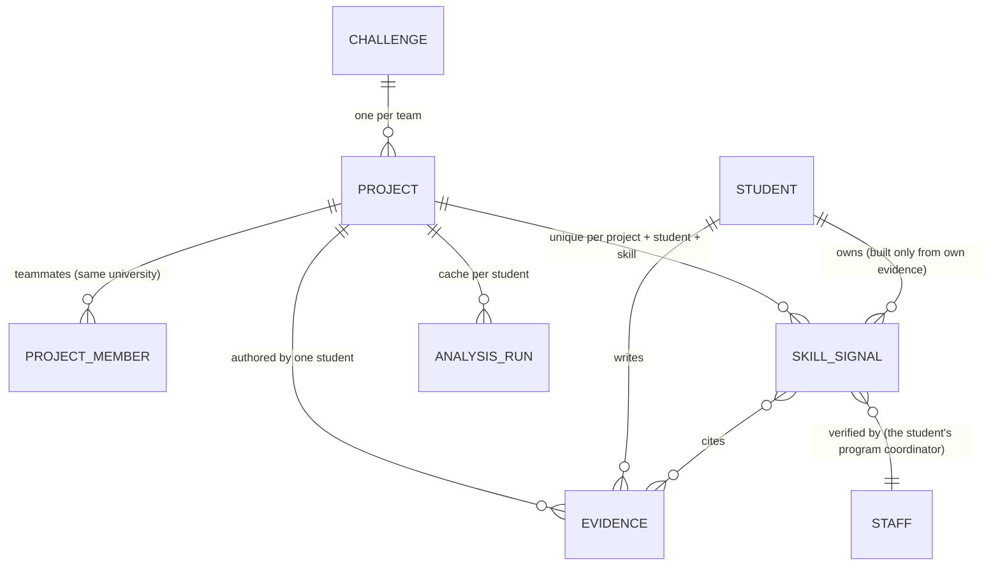

# WSL architecture

The same diagram as an image for slides: [`public/architecture.svg`](../public/architecture.svg) and
[`public/architecture.png`](../public/architecture.png) (regenerate both with `npm run docs:architecture`
after editing the diagram below).

## Components

| Component | Where | What it does |
|---|---|---|
| React app | `src/` | One app for all three roles. Every page reads one snapshot from the API; nothing is hard-coded. |
| Node API | `server/api.ts` | The only writer. Resolves the acting account from the `X-WSL-Actor` header, checks ownership, runs each write in a transaction, notifies affected accounts, returns a fresh snapshot. |
| SQLite | `server/db.ts`, `data/wsl.db` | Single-file database via `node:sqlite`. Schema migrations run on start; `server/seed.ts` loads the demo data. |
| PII screener | `server/screening.ts` | Scans a company's challenge text and attached files for personal data before any university can see it. |
| Relevance gate | `server/ml/analyze.ts` (`checkRelevance`) | Rejects evidence that mostly repeats the brief or has nothing to do with it. Normalizes Arabic; work in a different script than the brief is passed to the grader instead of rejected. |
| GitHub reader | `server/github.ts` | Reads a public repository's README and top source files so the work itself can be graded. |
| Evidence grader | `server/ai.ts`, `server/ml/llm-grader.ts` | Grades each required skill against named rubric criteria and must quote the student's own lines; quotes and criteria the model invents are dropped. |
| Result cache | `analysis_runs` (one row per project **and student**) | Unchanged evidence returns the stored result without a model call, so re-analysis is repeatable — and one teammate's new evidence never invalidates another's. |
| Offline scorer | `server/ml/analyze.ts` | Deterministic regex rubric used only when there is no model result to keep; clearly labeled as an estimate. |

## Key flows

**Data model for team proof** (`server/db.ts`)

The project is shared; everything that counts as proof is per student. `projects.owner_role_note` and
`project_members.role_note` hold each member's own account of what they contributed — a claim for the
reviewer, never proof.

**Evidence → verified skill**

1. A student submits evidence (GitHub, Documentation, Notebook, Report, Presentation, Demo / Video, Screenshot or a Contribution Statement). The relevance gate rejects copied or off-topic work with a specific reason; a GitHub link, a shared Google Doc or an attached file is read.
2. The student presses *Analyze*. The grader reads **only that student's own** analyzable evidence (statements, videos and screenshots are kept for the reviewer, never analyzed), and hashes it with the skills and model. A matching hash returns the stored result instantly; otherwise the model grades it. A skill the evidence doesn't show is *Insufficient evidence* — a statement about the submission, not the student.
3. If the model is unavailable (quota, outage), any skill it graded before keeps that result. Only a skill with no result yet gets an offline estimate, labeled "Estimated offline" with a Retry button. A failed run is never cached.
4. A university reviewer opens the project: one section per student with their contribution beside their evidence, then one card per required skill — what the evidence demonstrates, the lines behind it, the gaps. They verify, decline, or ask for more evidence, one student's one skill at a time. Only *Verify* adds the skill to that student's proof, and only that student is told.
5. Once every skill with evidence has a decision, for every student, the university confirms the project to the company. Companies discover students through their own verified skills — skill → project → contribution → evidence → university verification — and can give feedback, which never changes a verification.

**Demo resilience.** `npm run db:grade-seed` grades the seeded demo projects with the live model once and stores the result in `server/ml/seed-grades.json`. Seeding uses a stored result only while its evidence hash still matches, so the tour shows model-graded results without ever calling the model. `GET /api/health` reports the provider, model, and whether the key works.
